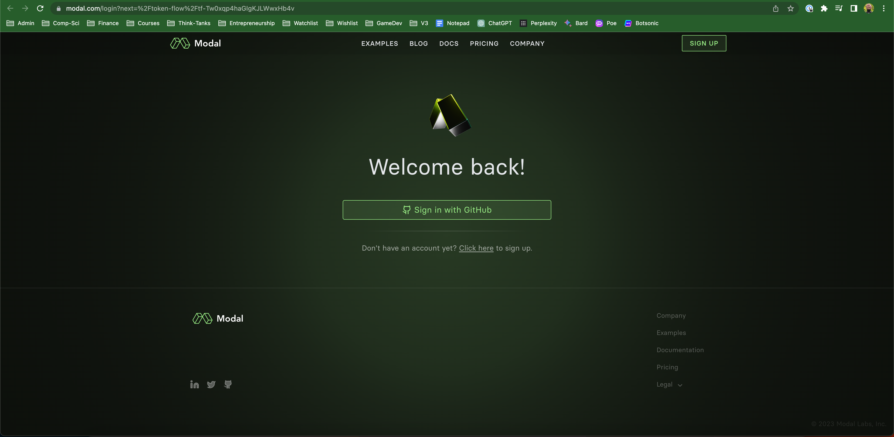
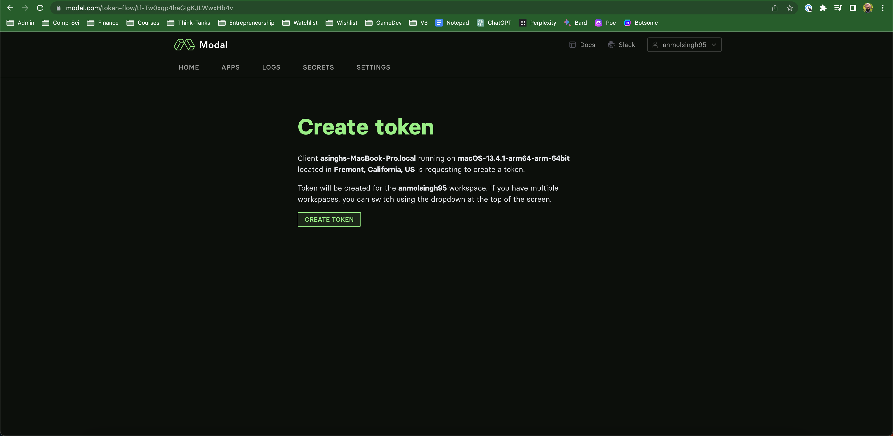

# Quick start

This tutorial will help you quickly get an API bot running with the help of our [starter code](https://github.com/poe-platform/api-bot-tutorial). We will go over how to deploy this code and how to integrate your bot server with Poe. For more information on Poe API bots, check out the [poe-protocol-specification](poe-protocol-specification/ "mention").

## Deploying your bot

We recommend using [Modal](https://modal.com/) to deploy your bot but you can also use the cloud provider of your choice; all you need to do is to make the bot server available at a publicly available URL and use that to [integrate with Poe](quick-start.md#integrating-with-poe). In order to use Modal to deploy your bot, do the following.

#### Step 1: Install the model client

Open a terminal and run `pip install modal-client`

#### Step 2: Setup modal token

In the terminal, run `modal token new`. You will taken to your web browser where you will be asked to log into modal using your Github account.

<figure><figcaption></figcaption></figure>

After you login, click on "create token". You will be prompted to close the browser window after that.

<figure><figcaption></figcaption></figure>

#### Step 3: Clone the starter code and deploy to Modal

In your terminal, run:

* `git clone https://github.com/poe-platform/api-bot-tutorial`
* `cd api-bot-tutorial`
* `modal serve main.py`

Modal will not deploy your app and output two urls: a) the endpoint at which your app is hosted b) an internal page you can go to in order to view your app. You will be using the former to integrate your bot into Poe.&#x20;

<figure><figcaption></figcaption></figure>

## Integrating with Poe

Once you have a bot running under a publicly accessible URL, it is time to connect it to Poe. You can do that on your desktop by going to [the bot creation form](https://poe.com/create\_bot?api=1). You can customize how your bot looks by providing a picture, name and description. After you fill out the server URL, click "create bot", your bot should be ready for use in all Poe clients!

## Iterating on the bot

For faster iteration on the bot, modal offers the serve command which you can use by running `modal serve main.py`. Modal will host for you an ephemeral app on the cloud which gets live-updated if you make any changes to the underlying code. Feel free to comment/uncomment any of the other example bots to try them out or build off of them.

## Where to go from here

* Refer to [poe-protocol](https://github.com/poe-platform/poe-protocol) to understand the full capabilities offered by Poe API bots and see some additional tools and samples, including:
  * The [specification](https://github.com/poe-platform/poe-protocol/blob/main/spec.md) that details precisely how API bots work
  * The [fastapi-poe](https://pypi.org/project/fastapi-poe/) library, which you can use as a base for creating Poe bots
