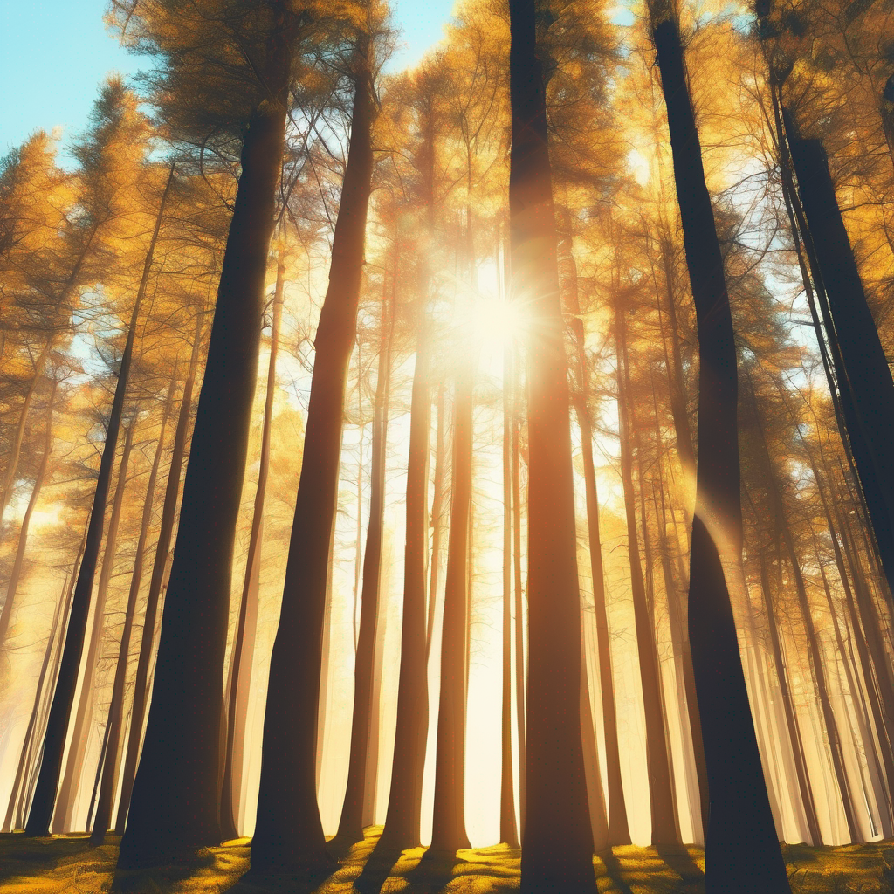

# Image generation

You can build image generation prompt bots using [StableDiffusionXL](https://poe.com/StableDiffusionXL). StableDiffusionXL supports a special syntax for [negative prompts](image-generation.md#negative-prompts) and [templating](image-generation.md#templating).

## Prompting tips

1. **Be descriptive, rather than instructive**. Unlike for text generation bots, the style prompt should describe the desired image, **not** be an instruction to the bot. For example, to generate paintings in the style of Vincent Van Gogh:

**Instead of:**

```
You are VanGoghBot. You will generate paintings in the style of Van Gogh.
```

**Try:**

```
painting, Van Gogh
```

2. **Be specific in your prompt:** The more specific and detailed your prompt is, the better the chances of getting the desired image. Instead of using a generic term like `landscape`, try specifying elements like `sunset over a beach with palm trees`. You can also specify multiple elements or style descriptions separated by punctuations, e.g. `beautiful sunset, rain, painting, Van Gogh`.
3. **Utilize the** [**negative prompt**](image-generation.md#negative-prompts)**:** If there are certain elements you don't want in your image, use the negative prompt feature. For example, if you don't want any buildings in your landscape, include `buildings` in your negative prompt.

### Negative prompts

Specify a `--no` parameter to indicate elements that should be avoided in the generated image.

For example:

<figure><figcaption><p><strong><code>tall trees, sunny --no rain</code></strong></p></figcaption></figure>

### How do style prompts and user prompts get merged?

By default, style prompts and user prompts get concatenated.&#x20;

For example, with a **style prompt**:

```
cartoon --no color
```

and a **user prompt**:

```
dog --no cat
```

The **final prompt** will be:

```
dog, cartoon --no cat, color
```

### Templating

Poe also supports Jinja templating for image generation bots to provide bot developers with flexibility over how style prompts and user prompts get merged.

Specifically, specify a `{{user_prompt}}` in either (or both!) of the style prompt and negative prompts to indicate where the user's prompt and negative prompts should go, respectively.

For example, with a **style prompt**:

```
happy, smiling {{user_prompt}} on a skateboard --no scooter, {{user_prompt}}, cartoon
```

and a **user prompt**:

```
dog --no cat
```

the **final prompt** will be:

```
happy, smiling dog on a skateboard --no scooter, cat, cartoon
```

