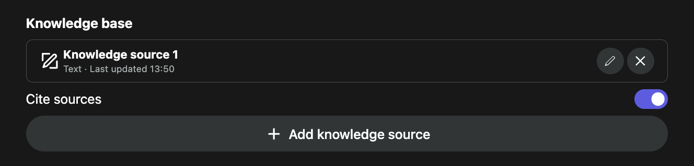

# How to create a prompt bot

## Step 1: Open the create bot page

If you are on web, go to [poe.com](https://poe.com) and click on the "Create a bot" button on the sidebar. Alternatively you can navigate directly to [poe.com/create\_bot](https://poe.com/create\_bot). If you are using the mobile app, click on the hamburger in the top-left to open the sidebar and then click on the "Create a bot" button.

<figure><figcaption></figcaption></figure>

## Step 2: Customize how your bot will look

#### Upload a picture (Optional)

This helps give your bot a distinctive look.

<figure><figcaption></figcaption></figure>

#### Select a bot name

The name is a unique identifier and can use 4-15 alphanumeric characters. The field will come prefilled with a randomly generated name that you can leave as it is. You can always come back and update the name later.

<figure><figcaption></figcaption></figure>

#### Write a bot description (Optional)

A piece of text that describes your bot. This will be shown to people who land on the bot page.

<figure><figcaption></figcaption></figure>

## Step 3: Define your bot's behavior

#### Select a base bot

This is the underlying bot that your prompt bot is powered by.

<figure><figcaption></figcaption></figure>

#### Provide a prompt

Describe what your bot should do or how it should behave. For more information on how to write a good prompt, check out [prompts best practices](best-practices-for-prompts.md) guide. You can also use the "Prompt visible from bot profile" option to decide whether your prompt should be visible to the public.

<figure><figcaption></figcaption></figure>

#### Provide an intro message (Optional)

This is message that the bot starts with when users land on the bot page. This can be used to explain to the users what the bot does or get necessary information that the bot needs to get started.

<figure><figcaption></figcaption></figure>

## Step 4: Decide if you need any advanced features (Optional)

#### Suggest replies

Whether a user should see some LLM-generated reply options after getting a response from the bot. This could help in lowering friction for users if the option is a good fit for your bot.

#### Render markdown content

Allows messages with the bot to be rendered using Markdown. If this is off, messages are rendered as plain text.&#x20;

Poe supports GitHub-Flavored Markdown (GFM, specified at [https://github.github.com/gfm/](https://github.github.com/gfm/)). However, for security and privacy reasons, prompt bots only support images hosted at imgur.com and unsplash.com. Images that use any other URL will fail to render. Please reach out to us on [Discord](https://discord.gg/TKxT6kBpgm) if you wish to make a request for us to support additional image hosting sites.

#### Custom temperature

Allows you to specify the temperature you want to use for your bot with higher temperatures leading to more randomness in a bot's response.

## Step 5: Create your bot

After filling out all the required fields, click on the "Create bot" button at the bottom. That's it! You should get taken to your new bot's page, and from there you can start chatting or share the bot with your friends.
